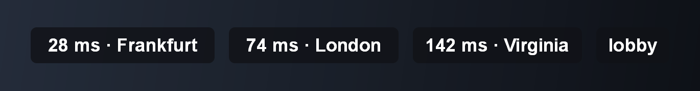

  

<h1 align="center">PingPeek</h1>

Your real ping to the Fortnite server you're on, in a small overlay.

  
  
  

  

<a href="https://github.com/Twiceyy/PingPeek/releases/latest/download/PingPeek.exe"><b>Download PingPeek.exe</b></a>

## Why

Fortnite's ping display is an average, so it hides spikes. Ping tools can't reach Fortnite's match
servers, so they test a different machine.

PingPeek reads the address of your match server from Fortnite's log and pings that exact server once a
second.

## Use

Download `PingPeek.exe` and run it. Windows 10 or 11, nothing to install.

- **Close:** run it again.
- **Move:** `PingPeek.exe X Y`, in pixels from the top-left of the game's screen.

It only shows while Fortnite is the active window, and clicks pass through it.

## What it shows

| | |
|---|---|
| `28 ms · Frankfurt` | Your ping, and where the server is |
| `connecting` | The first reading is on its way |
| `lost` | No reply that second |
| `lobby` | You're not in a match |
| `no ping data` | The game didn't report a server to ping |
| `no Fortnite log` | Fortnite's log file wasn't found |

## FAQ

**Why is it different from the in-game ping?** Fortnite averages over a few seconds. PingPeek shows
every reading.

**Anti-cheat?** PingPeek doesn't touch the game. It reads Fortnite's log file and draws its own window.

**"Windows protected your PC"?** The app isn't code-signed. Click **More info**, then **Run anyway**.
[SECURITY.md](SECURITY.md) shows how to verify a download.

## Build

Windows 10 or 11 and [Zig](https://ziglang.org) 0.17. `build.cmd` builds, `test.cmd` runs the tests.

## License

[MIT](LICENSE). Not affiliated with Epic Games. Fortnite is a trademark of Epic Games, Inc.
